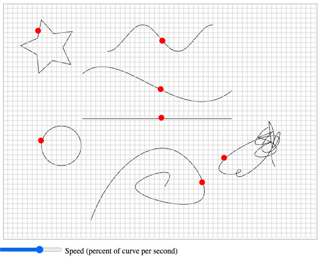

# SVG Tracer

Traces SVG paths in a canvas context with Javascript

## Usage

Adjust the slider from 1 (path takes 1s to travel) to 10 (path takes 10s to travel)

## Notes

SVG is saved straight out of Illustrator 2024. If a curve does not get a dot, right click the curve in Illustrator and select "Make Compound Path".
